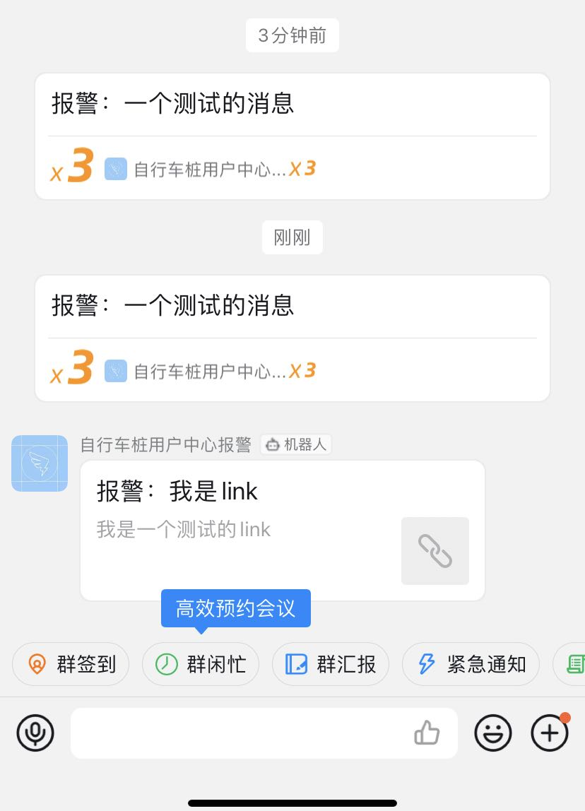

#### 可以发送微信通知、钉钉通知、邮箱通知、短信通知等...


````php
<?php

include "../vendor/autoload.php";
use Notice\Notice\NoticeFactory;

//钉钉通知
$dindin = NoticeFactory::dinDin([
  'webHookUrl' => ''
]);

//文本类型
$dindin->text('报警：一个测试的消息');
//link 类型
$dindin->link('报警：我是link', '我是一个测试的link', 'http://www.baidu.com');
//$dindin->markdown();
//$dindin->actionCard();
//$dindin->feedCard();


//NoticeFactory::wechat();
//NoticeFactory::sms();
//NoticeFactory::email();
````
- 效果如下：

- 目前暂时接入了钉钉通知，后续会逐步完善其他几个